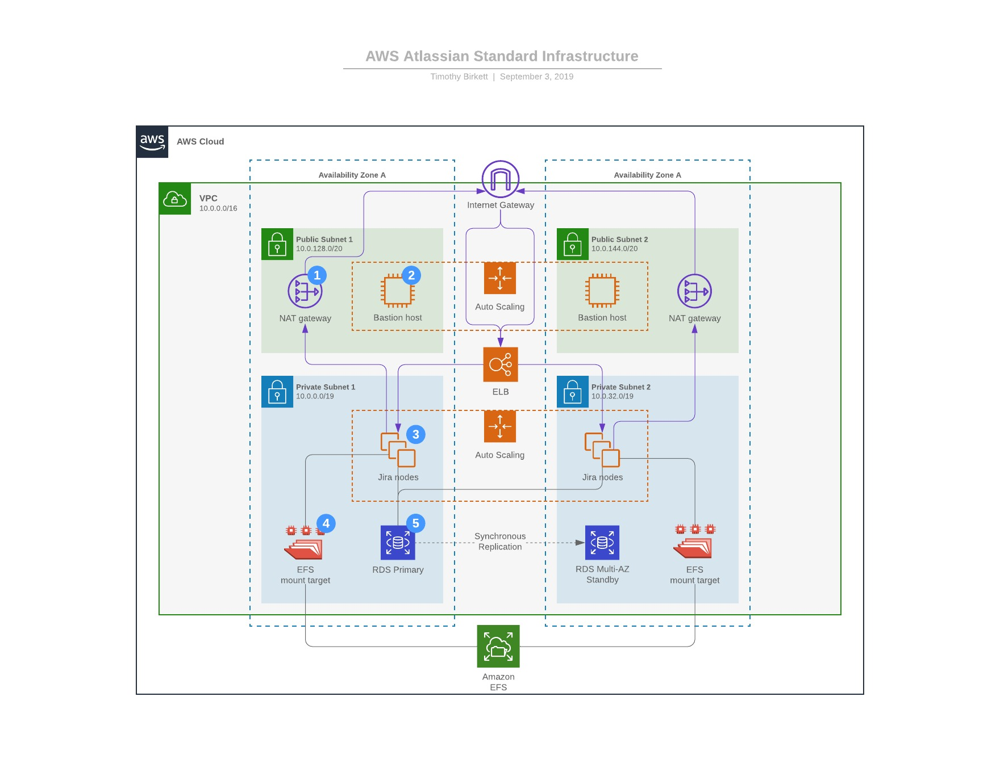

# Webs Infrastructure

Our webs product does cool stuff

## Support

Core support times: **0900-1700 with out of hours on-call**

## Webs Team Contacts

### Product Owner

- **Name:** Tea Rex
- **Email:** trex@dinocorp.org
- **Phone:** 0161 452 1212

### Platform Engineer

- **Name:** Dino Saurus
- **Email:** t@dinocorp.org
- **Phone:** 07771 777 777

### Development Lead

- **Name:** Codey McCodeface
- **Email:** codey@codeface.org
- **Phone:** 07728 222 222


## AWS Environments

### Dev Environments
**AWS Account:** [dinocorp-webs-dev (123456789)](https://dinocorp-webs-dev.signin.aws.amazon.com/console)

**Environments**

- **infradev:** 172.20.0.0/16
- **stg:** 172.21.0.0/16

### Prd Environments
**AWS Account:** [dinocorp-webs-prd (999999999)](https://dinocorp-webs-prd.signin.aws.amazon.com/console)

**Environments**

- **infraprd:** 172.120.0.0/16
- **prd:** 172.121.0.0/16


## Architecture



## [Documentation](docs/README.md)


## Platform Development
### Pre-requisites
```
# Installation of tooling etc here
```

---
`Re-generated: 2019-09-06T16:20:38+01:00`
